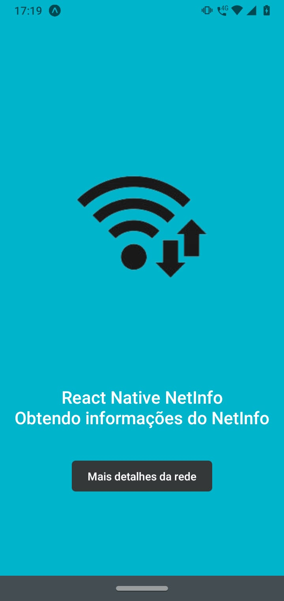
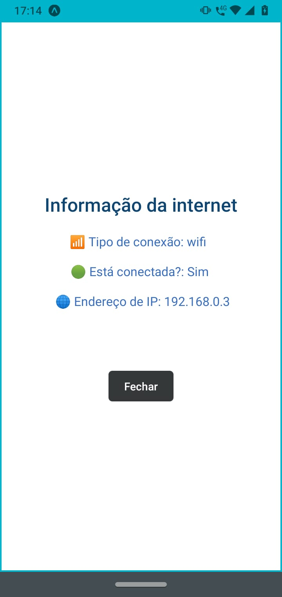

# Nome do Projeto

O projeto consiste em um aplicativo móvel desenvolvido em React Native que utiliza a biblioteca NetInfo para obter informações sobre a conexão de internet do dispositivo móvel em que está sendo executado. O aplicativo exibe uma imagem animada de um ícone de conexão Wi-Fi e um botão "Mais detalhes da rede". Quando o botão é pressionado, um modal é aberto e exibe informações sobre a conexão de internet, como tipo de conexão, se está conectada ou não e o endereço IP. O projeto utiliza hooks do React para gerenciar o estado do componente e o estilo dos elementos da interface do usuário é definido usando a API StyleSheet do React Native.

## Integrantes do Grupo

- Alexsander Lozano
- Felipe Gutierre
- Gustavo Souza Macedo

## Screenshots

Screenshots do aplicativo em funcionamento.

## Como executar

- Clone o repositório
- Abra o terminal e navegue até o diretório raiz do projeto
- Execute o comando `npm install` para instalar as dependências
- Execute o comando `npm start` para iniciar o aplicativo
- Escaneie o código QR com o aplicativo Expo Go para visualizar o aplicativo em seu dispositivo móvel, ou utilize um emulador de dispositivo móvel para visualizar o aplicativo em sua máquina.

## Tecnologias Utilizadas

- React Native
- NetInfo
- Moti

## Autoria

Desenvolvido por [Alexsander Lozano](https://github.com/AlexLzn03) durante o curso de Análise e Desenvolvimento de Sistemas (ADS).
Desenvolvido por [Felipe Gutierre](https://github.com/FelipeGtr01) durante o curso de Análise e Desenvolvimento de Sistemas (ADS).
Desenvolvido por [Gustavo Souza Macedo](https://github.com/GustavoMcd09) durante o curso de Análise e Desenvolvimento de Sistemas (ADS).
- 2023.

## Licença

Este projeto está licenciado sob a Licença MIT.

## Link do repositório

https://github.com/AlexLzn03/Aplicativo-com-NetInfo
